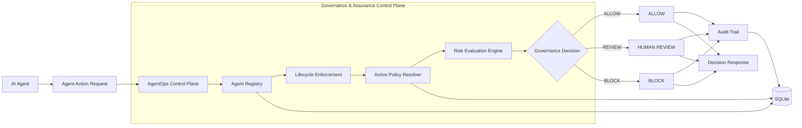
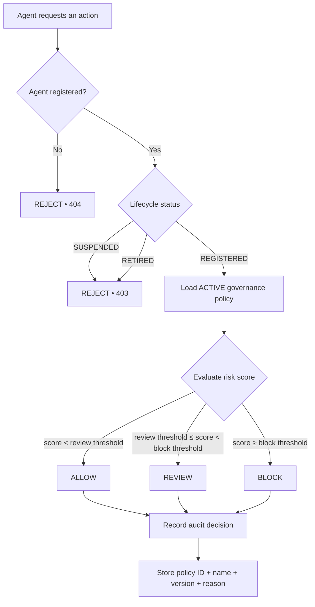
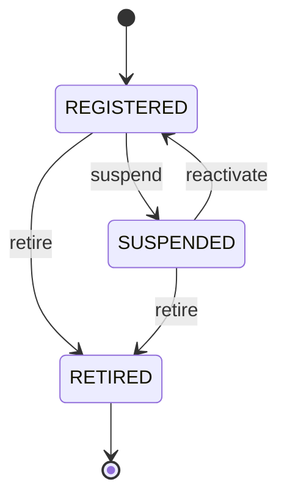
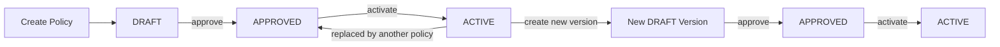
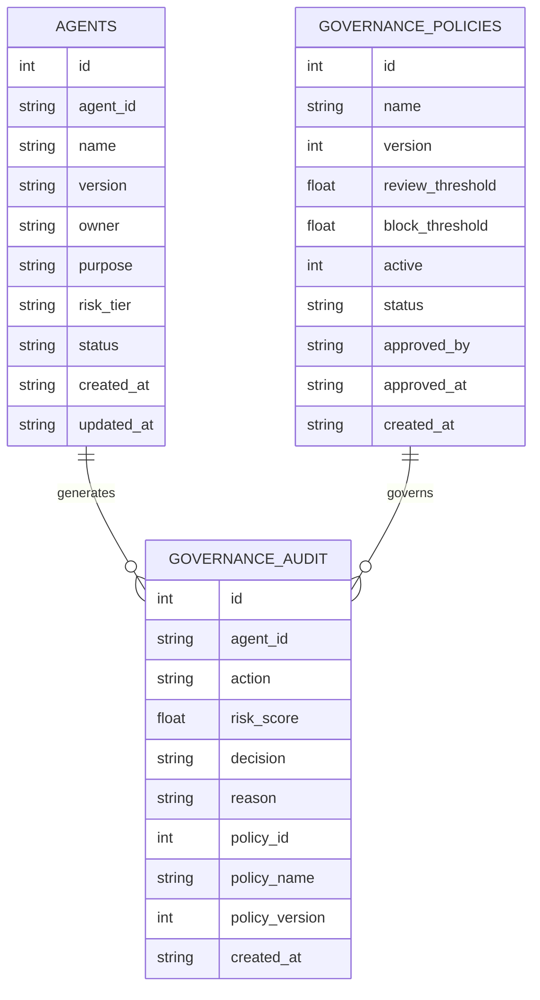

<div align="center">

# 🛡️ AgentOps Governance & Assurance Control Plane

### Runtime governance, policy enforcement and assurance for enterprise AI agents

[](https://git.io/typing-svg)


**Agent Registry • Lifecycle Enforcement • Policy Versioning • Approval Workflow • Runtime Decisions • Audit Traceability**

[Overview](#-overview) •
[Architecture](#-architecture) •
[Governance Flow](#-runtime-governance-flow) •
[Policies](#-policy-lifecycle) •
[API](#-api-surface) •
[Quick Start](#-quick-start) •
[Roadmap](#-roadmap)

</div>

---

## 🎯 Overview

**AgentOps Governance & Assurance Control Plane** is an API-first control layer for governing AI agents before they execute sensitive or high-risk actions.

Instead of allowing an agent to act solely because it has access to a model or tool, the control plane introduces explicit governance checks:

* Is the agent registered?
* Is its lifecycle status permitted to execute?
* Which governance policy is currently active?
* Which exact policy version made the decision?
* Does the action's risk score require `ALLOW`, `REVIEW`, or `BLOCK`?
* Can the resulting decision be traced later?

The project separates **agent execution intent** from **governance authority**.

> The agent proposes an action.
> The control plane decides whether that action is permitted.

---

## 🧠 The Problem

Enterprise agentic systems introduce a new operational problem.

An AI agent may be technically capable of calling:

* payment APIs
* customer databases
* internal systems
* workflow automation
* external tools
* privileged enterprise services

But **capability is not authorization**.

A production AI environment needs an independent layer that can answer:

```text
WHO is this agent?
        ↓
IS it currently permitted to operate?
        ↓
WHICH governance policy applies?
        ↓
WHAT is the risk of this action?
        ↓
ALLOW, REVIEW or BLOCK?
        ↓
CAN we prove later why that decision happened?
```

That is the role of this control plane.

---

# 🏗 Architecture



### Control-plane responsibilities

| Layer                 | Responsibility                                                 |
| --------------------- | -------------------------------------------------------------- |
| **Agent Registry**    | Identify registered agents and their versions                  |
| **Lifecycle Control** | Enforce `REGISTERED`, `SUSPENDED`, and `RETIRED` states        |
| **Policy Registry**   | Store governance policies independently from application code  |
| **Policy Versioning** | Preserve immutable historical policy versions                  |
| **Approval Workflow** | Prevent draft policies from becoming active without approval   |
| **Risk Engine**       | Convert action risk into `ALLOW`, `REVIEW`, or `BLOCK`         |
| **Audit Trail**       | Record decision, reason, agent, risk score and policy identity |
| **API Layer**         | Expose governance controls through FastAPI                     |

---

# 🚦 Runtime Governance Flow

Every governed action passes through lifecycle enforcement **before risk evaluation**.



### Example

Given an active policy:

```text
Review threshold = 0.40
Block threshold  = 0.70
```

The engine evaluates:

| Risk Score | Result      |
| ---------: | ----------- |
|     `0.20` | ✅ `ALLOW`   |
|     `0.40` | ⚠️ `REVIEW` |
|     `0.65` | ⚠️ `REVIEW` |
|     `0.70` | ⛔ `BLOCK`   |
|     `0.95` | ⛔ `BLOCK`   |

---

# 🤖 Agent Registry

Agents are persisted in SQLite rather than existing only for the lifetime of an API request.

Each registered version records:

```text
agent_id
name
version
owner
purpose
risk_tier
status
created_at
updated_at
```

### Risk tiers

```text
LOW
MEDIUM
HIGH
CRITICAL
```

### Lifecycle states



A retired version is terminal and cannot be reactivated.

---

# 📜 Policy Lifecycle

Governance policies are stored separately from the API implementation.

Thresholds therefore do not need to remain hard-coded inside `main.py`.



### Example policy history

```text
strict-enterprise-policy v1
        ↓
     APPROVED

strict-enterprise-policy v2
        ↓
      ACTIVE

strict-enterprise-policy v3
        ↓
       DRAFT
```

Versions are stored as separate records rather than overwriting previous governance rules.

This preserves historical explainability.

---

# 🔍 Decision Traceability

A governance decision records the policy that caused it.

Example:

```json
{
  "decision": "BLOCK",
  "reason": "Risk score exceeds block threshold 0.7.",
  "risk_score": 0.82,
  "policy_id": 4,
  "policy_name": "strict-enterprise-policy",
  "policy_version": 2
}
```

The corresponding audit record can later identify:

```text
Agent
Action
Risk Score
Decision
Reason
Policy ID
Policy Name
Policy Version
Timestamp
```

This avoids a common governance failure:

> "The system blocked this action, but we no longer know which rules were active at the time."

---

# ✅ Implemented Capabilities

| Capability                           | Status |
| ------------------------------------ | :----: |
| FastAPI control-plane API            |    ✅   |
| Health endpoint                      |    ✅   |
| Basic agent manifest validation      |    ✅   |
| Persistent SQLite agent registry     |    ✅   |
| Multiple agent versions              |    ✅   |
| Agent risk tiers                     |    ✅   |
| Agent lifecycle management           |    ✅   |
| Suspend agent                        |    ✅   |
| Reactivate agent                     |    ✅   |
| Retire agent                         |    ✅   |
| Prevent suspended agent execution    |    ✅   |
| Prevent retired agent execution      |    ✅   |
| Prevent unregistered agent execution |    ✅   |
| Governance policy registry           |    ✅   |
| Policy versioning                    |    ✅   |
| Draft policy state                   |    ✅   |
| Explicit policy approval             |    ✅   |
| Active policy management             |    ✅   |
| Risk-based `ALLOW / REVIEW / BLOCK`  |    ✅   |
| Governance audit trail               |    ✅   |
| Audit filtering                      |    ✅   |
| Policy ID traceability               |    ✅   |
| Policy version traceability          |    ✅   |
| Audit rejected lifecycle attempts    |   🔜   |
| Authentication / RBAC                |   🔜   |
| Tamper-evident audit chain           |   🔜   |
| PostgreSQL persistence               |   🔜   |
| Observability / telemetry            |   🔜   |

---

# 🔌 API Surface

## System

| Method | Endpoint  | Purpose          |
| ------ | --------- | ---------------- |
| `GET`  | `/`       | Service metadata |
| `GET`  | `/health` | Health check     |

## Agent Registry

| Method | Endpoint                        | Purpose                           |
| ------ | ------------------------------- | --------------------------------- |
| `POST` | `/validate-manifest`            | Validate required manifest fields |
| `POST` | `/register-agent`               | Persist a new agent/version       |
| `GET`  | `/agents`                       | List/filter registered agents     |
| `GET`  | `/agents/{agent_id}`            | Retrieve all versions of an agent |
| `POST` | `/agents/{agent_id}/suspend`    | Suspend latest agent version      |
| `POST` | `/agents/{agent_id}/reactivate` | Reactivate suspended version      |
| `POST` | `/agents/{agent_id}/retire`     | Permanently retire latest version |

## Governance

| Method | Endpoint               | Purpose                  |
| ------ | ---------------------- | ------------------------ |
| `POST` | `/governance/evaluate` | Evaluate an agent action |

## Policies

| Method | Endpoint                         | Purpose                     |
| ------ | -------------------------------- | --------------------------- |
| `GET`  | `/policies`                      | List all policy versions    |
| `POST` | `/policies`                      | Create policy v1 as `DRAFT` |
| `GET`  | `/policies/{policy_id}/versions` | List policy version history |
| `POST` | `/policies/{policy_id}/versions` | Create next policy version  |
| `POST` | `/policies/{policy_id}/approve`  | Approve a draft policy      |
| `POST` | `/policies/{policy_id}/activate` | Activate an approved policy |

## Audit

| Method | Endpoint | Purpose                           |
| ------ | -------- | --------------------------------- |
| `GET`  | `/audit` | Query governance decision history |

Audit supports filters including:

```text
agent_id
decision
policy_id
limit
```

---

# ⚡ Quick Start

## 1. Clone the repository

```cmd
git clone YOUR_REPOSITORY_URL

cd "AgentOps Governance & Assurance Control Plane"
```

## 2. Create the Python environment

```cmd
python -m venv .venv
```

## 3. Activate it on Windows

```cmd
.venv\Scripts\activate
```

## 4. Install dependencies

```cmd
python -m pip install -r requirements.txt
```

## 5. Start the control plane

```cmd
python -m uvicorn app.main:app --reload
```

API:

```text
http://127.0.0.1:8000
```

Interactive Swagger documentation:

```text
http://127.0.0.1:8000/docs
```

---

# 🧪 Example Workflow

## 1. Register an agent

```cmd
curl -X POST "http://127.0.0.1:8000/register-agent" -H "Content-Type: application/json" -d "{\"agent_id\":\"refund-agent\",\"name\":\"Refund Agent\",\"version\":\"1.0.0\",\"owner\":\"payments-ai\",\"purpose\":\"Evaluate customer refund requests\",\"risk_tier\":\"HIGH\"}"
```

---

## 2. Evaluate an action

```cmd
curl -X POST "http://127.0.0.1:8000/governance/evaluate" -H "Content-Type: application/json" -d "{\"agent_id\":\"refund-agent\",\"action\":\"process_refund\",\"risk_score\":0.82}"
```

Example response:

```json
{
  "decision": "BLOCK",
  "reason": "Risk score exceeds block threshold 0.7.",
  "risk_score": 0.82,
  "policy_id": 4,
  "policy_name": "strict-enterprise-policy",
  "policy_version": 2
}
```

---

## 3. Suspend the agent

```cmd
curl -X POST "http://127.0.0.1:8000/agents/refund-agent/suspend"
```

The agent can no longer pass the lifecycle enforcement gate.

---

## 4. Attempt another action

```cmd
curl -i -X POST "http://127.0.0.1:8000/governance/evaluate" -H "Content-Type: application/json" -d "{\"agent_id\":\"refund-agent\",\"action\":\"process_refund\",\"risk_score\":0.20}"
```

Expected:

```text
HTTP/1.1 403 Forbidden
```

The risk score is irrelevant because the lifecycle gate executes first.

---

## 5. Reactivate

```cmd
curl -X POST "http://127.0.0.1:8000/agents/refund-agent/reactivate"
```

---

# 🧩 Project Structure

```text
AgentOps Governance & Assurance Control Plane/
│
├── app/
│   ├── __init__.py
│   │
│   ├── main.py
│   │   └── FastAPI routes and control-plane orchestration
│   │
│   ├── models.py
│   │   └── Pydantic request and response models
│   │
│   ├── agents.py
│   │   └── Agent registry and lifecycle persistence
│   │
│   ├── policies.py
│   │   └── Policy registry, versions, approval and activation
│   │
│   └── audit.py
│       └── Governance decision audit persistence
│
├── agent_registry.db
│   └── Local SQLite persistence
│
├── requirements.txt
│
└── README.md
```

---

# 🧭 Control-Plane Design Principles

### 1. Identity before execution

An unknown agent cannot enter normal governance evaluation.

### 2. Lifecycle before risk

A suspended or retired agent is rejected regardless of its reported risk score.

### 3. Policies are data

Governance thresholds are persisted policies rather than scattered constants inside application logic.

### 4. Policy changes are versioned

Changing governance rules creates another policy version instead of destroying historical configuration.

### 5. Promotion is explicit

```text
DRAFT → APPROVED → ACTIVE
```

Policy creation alone cannot silently modify the active governance regime.

### 6. Decisions carry provenance

Every normal governance decision identifies the policy and version responsible for it.

### 7. Registry, policy and audit concerns remain separated

The API orchestrates independent governance components rather than placing all persistence logic inside one file.

---

# 🗃 Current Persistence Model



> The diagram represents the logical governance relationships. The current SQLite implementation does not yet enforce all of these relationships as database foreign-key constraints.

---

# 🛣 Roadmap

```mermaid
flowchart LR

    A["Agent Registry ✅"] --> B["Lifecycle Enforcement ✅"]

    B --> C["Versioned Policies ✅"]

    C --> D["Approval Workflow ✅"]

    D --> E["Decision Traceability ✅"]

    E --> F["Denied-Event Auditing"]

    F --> G["RBAC + Authentication"]

    G --> H["Tamper-Evident Audit"]

    H --> I["PostgreSQL"]

    I --> J["OpenTelemetry"]

    J --> K["Enterprise Policy Assignment"]

    K --> L["Distributed Agent Governance"]
```



### Near-term

* Log attempted execution by suspended and retired agents
* Log unknown/unregistered-agent enforcement events
* Separate enforcement events from normal governance decisions
* Add actor identity to administrative changes
* Add policy assignment by agent/risk tier
* Add API authentication and role-based authorization

### Later

* PostgreSQL persistence
* Database migration framework
* Cryptographic/tamper-evident audit chain
* OpenTelemetry traces and metrics
* Governance dashboards
* External policy engines
* Human-review workflow
* Tool-level authorization
* Distributed control-plane deployment

---

# ⚠️ Current Boundaries

The current implementation deliberately remains focused.

At this stage:

* SQLite is the persistence layer
* one active governance policy is applied globally
* the caller supplies the action `risk_score`
* authentication and RBAC are not yet implemented
* lifecycle-rejected requests are not yet persisted to the audit table
* the API returns the governance decision but does not itself invoke downstream enterprise tools

These are explicit roadmap items rather than hidden assumptions.

---

# 🌐 Target Architecture

The long-term direction is a control plane positioned between autonomous agents and enterprise execution surfaces:

```text
┌───────────────────────────────────────────────────────────┐
│                    Enterprise AI Estate                   │
│                                                           │
│   Agent A        Agent B        Agent C        Agent N     │
└──────┬──────────────┬──────────────┬──────────────┬───────┘
       │              │              │              │
       └──────────────┴──────┬───────┴──────────────┘
                             │
                             ▼
              ┌─────────────────────────────┐
              │       AgentOps Control      │
              │            Plane            │
              │                             │
              │  Identity                   │
              │  Lifecycle                  │
              │  Policy                     │
              │  Risk                       │
              │  Approval                   │
              │  Enforcement                │
              │  Audit                      │
              └──────────────┬──────────────┘
                             │
               ALLOW / REVIEW / BLOCK
                             │
                             ▼
              ┌─────────────────────────────┐
              │ Enterprise Tools & Systems  │
              │                             │
              │ APIs • Data • SaaS • Cloud │
              └─────────────────────────────┘
```

---

<div align="center">

## 🛡️ Govern the agent. Version the policy. Trace the decision.

**AgentOps Governance & Assurance Control Plane**

Built as an evolving reference implementation for runtime governance of enterprise AI agents.

</div>
