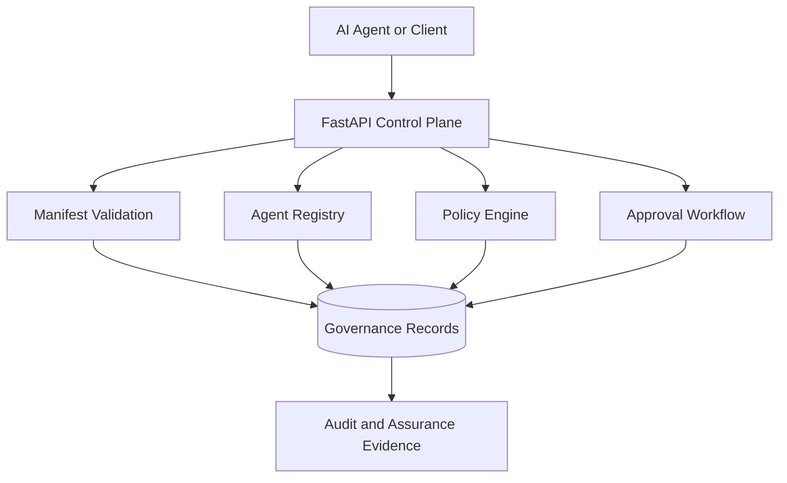
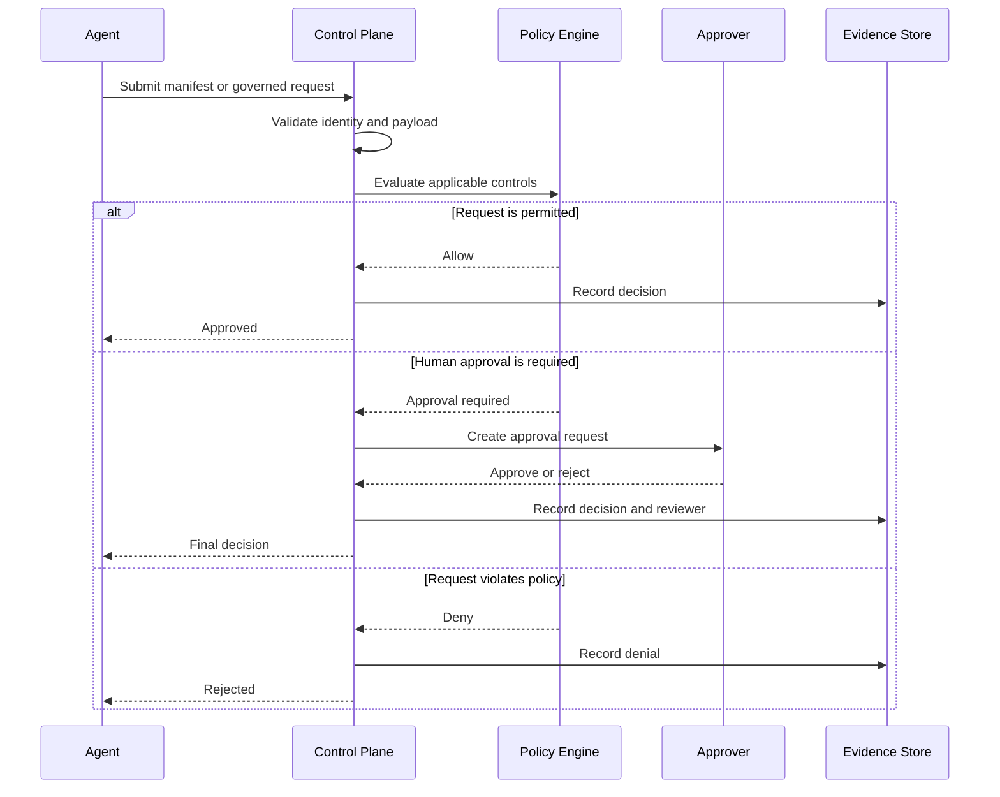
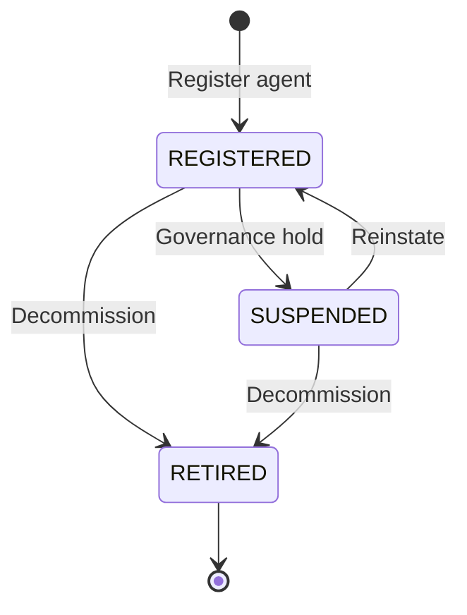
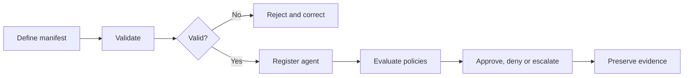

<div align="center">

# AgentOps Governance & Assurance Control Plane


<p>
  
  
  
  
</p>

<p>
  A vendor-neutral control plane for registering AI agents, validating their
  manifests, evaluating governance policies, managing approvals and preserving
  evidence for assurance and audit.
</p>

[Features](#core-capabilities) •
[Architecture](#architecture) •
[Workflow](#governance-workflow) •
[Quick Start](#quick-start) •
[API](#api-surface) •
[Roadmap](#roadmap)

</div>

---

## Why this project exists

Enterprise AI agents can call tools, access sensitive information and make
decisions across business systems. Those actions require controls that operate
before, during and after execution.

This control plane creates a governance boundary between an AI agent and the
resources it wants to use.

| Governance question | Control-plane response |
|---|---|
| Which agent is making the request? | Persistent agent registration |
| Is its manifest structurally valid? | Manifest validation |
| Is the requested action permitted? | Policy evaluation |
| Does a person need to approve it? | Human approval workflow |
| Can the decision be reconstructed later? | Audit-ready evidence |
| Can a risky agent be disabled? | Agent lifecycle status |

---

## Core capabilities

### Agent registry

- Registers agents using governed metadata
- Preserves agent identity and version information
- Supports risk classifications from `LOW` to `CRITICAL`
- Tracks lifecycle states such as `REGISTERED`, `SUSPENDED` and `RETIRED`
- Prevents conflicting registrations

### Manifest assurance

- Validates agent manifests before registration
- Rejects invalid or incomplete governance metadata
- Separates manifest validation from persistence
- Produces predictable API responses

### Policy governance

- Evaluates requests against governance policies
- Supports controlled policy lifecycle changes
- Separates policy definition, submission and approval
- Keeps human decision points explicit

### Auditability

- Produces structured governance decisions
- Preserves evidence needed for review
- Makes approval and registration activity inspectable
- Supports future compliance-reporting integrations

---

## Architecture



The API acts as the governance gateway. Validation, registration, policy
evaluation and approval decisions create structured evidence that can be
reviewed independently of the agent.

---

## Governance workflow



---

## Agent lifecycle



---

## Technology stack

| Layer | Technology | Responsibility |
|---|---|---|
| API | FastAPI | HTTP endpoints and OpenAPI documentation |
| Validation | Pydantic | Typed requests and response validation |
| Runtime | Uvicorn | Local ASGI server |
| Persistence | SQLite | Lightweight persistent governance records |
| Language | Python | Policy, workflow and registry logic |
| Documentation | Swagger UI | Interactive endpoint testing |
| Diagrams | Mermaid | GitHub-native architecture visualisation |

---

## Project structure

```text
AgentOps Governance & Assurance Control Plane/
│
├── app/
│   ├── __init__.py
│   ├── main.py
│   ├── models.py
│   ├── agents.py
│   └── policies.py
│
├── docs/
├── examples/
├── schemas/
├── requirements.txt
├── .gitignore
└── README.md
```

### Important modules

| File | Purpose |
|---|---|
| `app/main.py` | FastAPI application and route definitions |
| `app/models.py` | Validated request and response models |
| `app/agents.py` | Persistent agent-registry operations |
| `app/policies.py` | Governance policy and approval logic |

---

## Quick start

### 1. Clone and enter the repository

```bash
git clone <your-repository-url>
cd "AgentOps Governance & Assurance Control Plane"
```

### 2. Create a virtual environment

#### Windows Command Prompt

```bat
python -m venv .venv
.venv\Scripts\activate
```

#### macOS or Linux

```bash
python3 -m venv .venv
source .venv/bin/activate
```

### 3. Install dependencies

```bash
python -m pip install --upgrade pip
pip install -r requirements.txt
```

### 4. Start the API

```bash
python -m uvicorn app.main:app --reload
```

### 5. Open the interactive documentation

```text
http://127.0.0.1:8000/docs
```

Alternative OpenAPI documentation:

```text
http://127.0.0.1:8000/redoc
```

---

## API surface

The interactive Swagger page at `/docs` is the source of truth for the current
request schemas and available routes.

| Method | Endpoint | Purpose |
|---|---|---|
| `POST` | `/validate-manifest` | Validate an agent manifest |
| `POST` | `/register-agent` | Register and persist a governed agent |
| `GET` | `/agents` | Search and filter registered agents |

### Agent filters

`GET /agents` supports:

| Parameter | Accepted values |
|---|---|
| `limit` | `1` to `500`; default `50` |
| `status` | `REGISTERED`, `SUSPENDED`, `RETIRED` |
| `risk_tier` | `LOW`, `MEDIUM`, `HIGH`, `CRITICAL` |

### Example registration request

```json
{
  "agent_id": "finance-reconciliation-agent",
  "name": "Finance Reconciliation Agent",
  "version": "1.0.0",
  "owner": "finance-ai-team",
  "risk_tier": "HIGH",
  "status": "REGISTERED"
}
```

Use the exact schema displayed by `/docs` if the local model contains additional
required fields.

---

## Example governance journey



---

## Governance principles

1. **Default to control**  
   Agent actions must pass through an explicit governance decision.

2. **Keep humans accountable**  
   High-impact decisions can be escalated to authorised reviewers.

3. **Preserve evidence**  
   Important decisions should be reproducible during assurance reviews.

4. **Separate duties**  
   Agent developers, policy owners and approvers have distinct responsibilities.

5. **Remain vendor neutral**  
   Governance should not depend on one model provider or agent framework.

6. **Fail safely**  
   Invalid, conflicting or unevaluated requests should not silently proceed.

---

## Enterprise use cases

- AI-agent onboarding and registration
- Tool-use authorisation
- High-risk action approval
- Model and prompt change governance
- Data-access policy enforcement
- Agent suspension and retirement
- Internal assurance reviews
- Regulatory evidence preparation
- Cross-platform agent inventory
- Governance reporting

---

## Roadmap

- [x] Manifest validation
- [x] Persistent agent registry
- [x] Agent search and filtering
- [x] Governance policy evaluation
- [x] Policy approval workflow
- [ ] Agent suspension and retirement endpoints
- [ ] Tamper-evident audit-event chain
- [ ] Role-based reviewer permissions
- [ ] Policy version history
- [ ] Execution evidence ingestion
- [ ] Risk and compliance dashboard
- [ ] PostgreSQL persistence option
- [ ] OpenTelemetry observability
- [ ] Docker deployment
- [ ] Automated test suite and CI pipeline

---

## Development

Start the service in development mode:

```bash
python -m uvicorn app.main:app --reload
```

Check the current Git changes:

```bash
git status
git diff
```

When adding a capability:

1. Define or update the validated models.
2. Implement domain logic outside the route handler.
3. Expose the smallest necessary API surface.
4. Record governance-relevant decisions.
5. Test successful and rejected requests.
6. Update this README and the OpenAPI examples.

---

## Security status

This project is under active development and is not yet intended to be used as
the sole security boundary for production AI systems.

Before production deployment, add:

- Authentication and role-based authorisation
- Secret management
- Database migrations and backups
- Rate limiting
- Request signing
- Tamper-evident audit storage
- Dependency and container scanning
- Network isolation
- Centralised monitoring and alerting

Never commit credentials, tokens, private keys or production data.

---

## Project vision

The goal is to provide an enterprise governance layer where every AI agent has:

- A known identity
- A declared owner
- A versioned manifest
- A risk classification
- Explicit permissions
- Human oversight where required
- Reconstructable decision evidence
- A controlled lifecycle

---

<div align="center">

### Govern the agent, verify the decision, preserve the evidence.

Built as an enterprise AgentOps governance and assurance portfolio project.

</div>