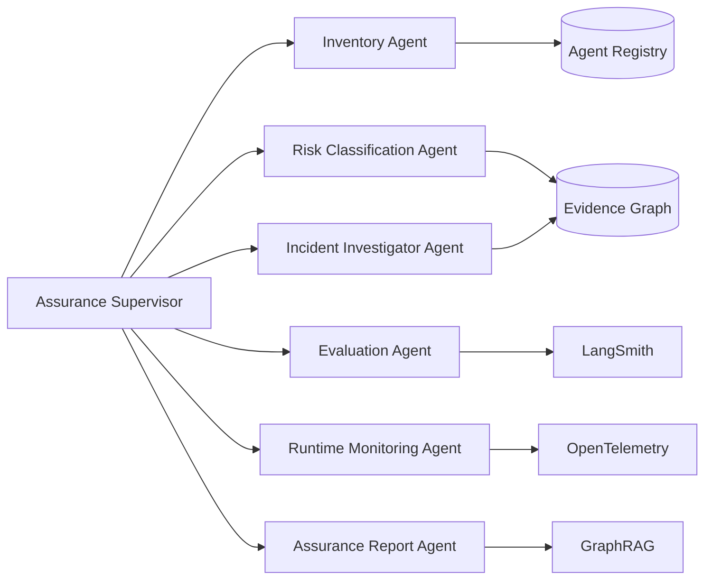
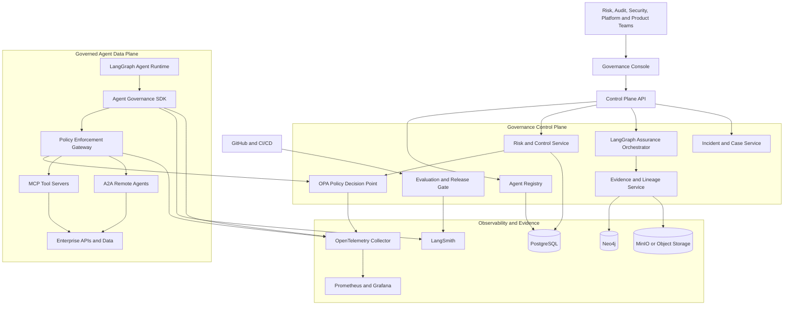
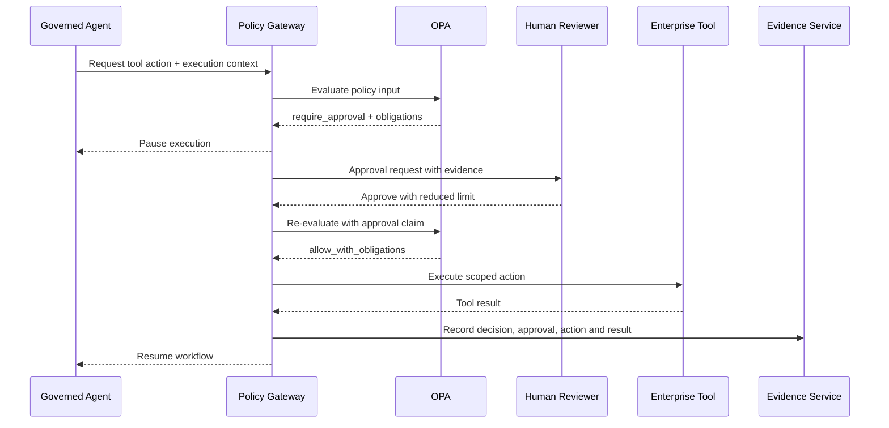

# AgentOps Governance & Assurance Control Plane

> **Policy-enforced, evidence-first governance for enterprise AI agents.**

The AgentOps Governance & Assurance Control Plane is an open-source platform for registering, evaluating, authorising, monitoring, investigating, and auditing AI agents across their full lifecycle.

It is designed for organisations moving from isolated copilots to **tool-using, stateful, multi-agent systems** where conventional application monitoring is not enough.

## Why this project exists

Enterprise agents can:

- call internal and external tools
- access sensitive data
- delegate work to other agents
- retain memory across sessions
- initiate high-impact business actions
- change behaviour when prompts, models, tools, or data change

Most teams can observe an agent trace. Far fewer can answer:

- Which agent was authorised to perform this action?
- Which policy allowed or denied it?
- What model, prompt, tool, data source, and memory influenced the outcome?
- Was human approval required and obtained?
- Which release evaluation justified deployment?
- What evidence can be supplied to risk, audit, compliance, or an external assessor?
- Can the action be paused, overridden, replayed, or shut down?

This project turns those questions into a working control plane.

---

## Core principle

> **LLMs recommend. Deterministic controls enforce.**

LLM-powered assurance agents may classify risk, propose controls, analyse incidents, and draft reports. They do **not** make final authorisation decisions.

Runtime enforcement is performed by deterministic components:

- Open Policy Agent policies
- identity and access controls
- explicit approval gates
- tool and data permissions
- spend, token, latency, and iteration budgets
- rate limits and circuit breakers
- pause, rollback, and kill-switch controls

---

## Flagship demonstration

The initial governed workload is an **Insurance Claims Resolution Agent** built with LangGraph.

The agent can:

1. retrieve claim and policy information
2. analyse evidence
3. recommend a settlement
4. call customer and payment tools
5. request specialist review
6. delegate fraud screening to another agent

The control plane demonstrates the following scenario:

1. A new prompt or model version is submitted through GitHub.
2. Offline safety, quality, and tool-use evaluations run in CI.
3. The release gate blocks deployment when thresholds fail.
4. A runtime agent attempts to access sensitive customer data and approve a high-value settlement.
5. The policy gateway evaluates identity, agent risk tier, data classification, action value, tool scope, and prior approvals.
6. The action is denied or paused through a LangGraph human-in-the-loop interrupt.
7. An authorised reviewer approves, modifies, or rejects the action.
8. OpenTelemetry and LangSmith traces capture the execution.
9. The evidence graph links the agent, version, model, prompt, tool call, policy decision, approval, data source, and outcome.
10. An Assurance Report Agent produces a cited evidence pack and incident timeline.

This single demo shows orchestration, tools, memory, evaluation, observability, policy-as-code, human oversight, GraphRAG, auditability, and incident response.

---

## Platform capabilities

### 1. Enterprise agent registry

A central inventory of:

- agents and subagents
- owners and accountable executives
- business purpose and affected stakeholders
- risk classification
- models and model providers
- prompts and configuration versions
- tools, MCP servers, and A2A endpoints
- data sources and classifications
- memory stores and retention rules
- deployment environments
- evaluation status
- active policy bundle
- incidents and exceptions

Each agent is registered using a version-controlled `agent-manifest.yaml`.

### 2. Risk and control mapping

The Risk Classification Agent:

- screens the use case and autonomy level
- identifies affected stakeholders
- identifies data, security, safety, and operational risks
- proposes a risk tier
- maps risks to controls
- records accountable owners
- creates reassessment triggers

Initial framework mappings:

- Australian Government Guidance for AI Adoption
- ISO/IEC 42001 AI management systems
- NIST AI RMF and the Generative AI Profile

The platform provides **control mappings and evidence support**, not legal advice or automatic certification.

### 3. Policy-as-code enforcement

A Policy Enforcement Point intercepts sensitive operations before execution:

- model calls
- tool calls
- data retrieval
- memory reads and writes
- agent-to-agent delegation
- external communication
- financial or customer-impacting actions

It submits structured context to Open Policy Agent and receives one of four decisions:

```json
{
  "decision": "require_approval",
  "reason_codes": [
    "HIGH_VALUE_ACTION",
    "SENSITIVE_CUSTOMER_DATA"
  ],
  "required_role": "claims_supervisor",
  "redactions": ["customer.tax_file_number"],
  "max_validity_seconds": 900
}
```

Supported outcomes:

- `allow`
- `deny`
- `require_approval`
- `allow_with_obligations`

Obligations can require redaction, stronger authentication, reduced tool scope, additional logging, or post-action review.

### 4. Evaluation and release assurance

LangSmith is used for trace inspection, datasets, experiments, and online/offline evaluations.

Release gates can evaluate:

- task success
- groundedness and citation correctness
- tool selection accuracy
- tool argument correctness
- unauthorised tool attempts
- prompt-injection resistance
- sensitive-data leakage
- policy compliance
- delegation correctness
- loop termination
- human escalation behaviour
- latency, token usage, and cost
- regression against the approved baseline

A model, prompt, policy, tool, or retrieval change creates a new assurance run.

### 5. Runtime supervision

The Runtime Supervisor monitors:

- policy denials and approval requests
- repeated tool failures
- excessive delegation depth
- runaway loops
- unusual token or cost consumption
- abnormal latency
- memory boundary violations
- anomalous data access
- evaluation drift
- model or provider changes
- tool schema changes

Available interventions:

- pause a thread
- revoke a tool
- reduce permissions
- route to a safer model
- force human review
- roll back a deployment
- quarantine an agent version
- terminate execution

### 6. Evidence and lineage graph

Neo4j stores the relationships between:

- organisation
- business process
- agent
- agent version
- subagent
- model
- prompt
- tool
- MCP server
- A2A agent
- dataset
- data source
- memory store
- policy
- control
- risk
- evaluation
- deployment
- execution
- policy decision
- human approval
- incident
- evidence artifact

Example assurance queries:

- Which production agents can access customer PII?
- Which agents use a model version that failed the latest safety evaluation?
- Which high-risk actions were approved by a human after a policy denial?
- Which tools are reachable through an A2A delegation path?
- What evidence supports the release of agent version `claims-agent:1.4.2`?
- Which controls would be affected if an MCP server were compromised?

### 7. GraphRAG assurance assistant

The Assurance Assistant combines:

- graph traversal over system lineage and controls
- semantic retrieval over policies, risk assessments, test reports, incidents, and approvals
- source-level citations
- permission-aware retrieval

It answers governance questions using the organisation's evidence rather than relying on model memory.

### 8. Incident investigation and replay

An Incident Investigator Agent:

1. reconstructs the execution timeline
2. identifies the first policy, tool, data, or model deviation
3. compares the incident with the approved release baseline
4. links relevant traces, policy decisions, approvals, and evidence
5. proposes containment and remediation
6. generates a reviewable post-incident report

LangGraph checkpoints support controlled replay from selected execution states. Replay is isolated from production tools by default.

---

## Multi-agent assurance team



The supervisor uses LangGraph to coordinate specialist agents, checkpoint case state, request human input, and resume work safely.

---

## High-level architecture



---

## Runtime authorisation sequence



---

## Memory model

The platform separates memory by purpose and trust boundary.

| Memory class | Technology | Scope | Examples |
|---|---|---|---|
| Working state | LangGraph checkpoint | One execution thread | current task, pending approval, retry state |
| Case memory | PostgreSQL | One governed case | decisions, reviewer comments, exceptions |
| Governance memory | PostgreSQL + Neo4j | Tenant and system scoped | risks, controls, owners, lineage |
| Knowledge memory | GraphRAG indexes | Permission scoped | policies, standards, test reports |
| Telemetry retention | LangSmith + OpenTelemetry backend | Environment and tenant scoped | traces, metrics, events |

No unrestricted cross-tenant or cross-purpose memory is allowed.

---

## Technology stack

| Layer | Initial choice |
|---|---|
| Agent orchestration | LangGraph |
| Agent tracing and evaluation | LangSmith |
| API | FastAPI + Pydantic |
| Web console | Next.js + TypeScript |
| Policy decision engine | Open Policy Agent |
| Agent/tool interoperability | MCP and A2A |
| Distributed telemetry | OpenTelemetry |
| Infrastructure monitoring | Prometheus + Grafana |
| Registry and case data | PostgreSQL |
| Evidence and lineage graph | Neo4j |
| Artifact storage | MinIO locally; cloud object storage in production |
| Event transport | NATS JetStream |
| Identity | OIDC; Keycloak locally |
| Packaging | Docker Compose for MVP |
| Production target | Kubernetes + Terraform |
| Testing | Pytest, Ruff, mypy, Playwright |
| CI/CD | GitHub Actions |

### Why both LangSmith and OpenTelemetry?

- **LangSmith** provides agent-native traces, datasets, experiments, evaluators, and production quality analysis.
- **OpenTelemetry** provides vendor-neutral traces, metrics, and logs across APIs, policy gateways, databases, queues, and infrastructure.

The control plane correlates both using shared tenant, agent, version, execution, trace, and case identifiers.

Sensitive prompt, completion, tool, and retrieved content is redacted or omitted by default. Content capture is explicitly policy-controlled.

---

## Proposed repository structure

```text
agentops-governance-control-plane/
├── apps/
│   ├── control-plane-api/          # FastAPI
│   └── governance-console/         # Next.js
├── agents/
│   ├── assurance-supervisor/       # LangGraph supervisor
│   ├── risk-classifier/
│   ├── evaluation-agent/
│   ├── incident-investigator/
│   ├── assurance-reporter/
│   └── demo-claims-agent/
├── packages/
│   ├── governance-sdk/             # Runtime interception and context
│   ├── policy-client/
│   ├── telemetry/
│   ├── evidence-model/
│   └── agent-manifest/
├── services/
│   ├── policy-gateway/
│   ├── evidence-service/
│   ├── graph-rag-service/
│   └── approval-service/
├── policies/
│   ├── rego/
│   ├── bundles/
│   └── tests/
├── evals/
│   ├── datasets/
│   ├── evaluators/
│   └── release-gates/
├── examples/
│   ├── agent-manifest.example.yaml
│   └── policy-input.example.json
├── docs/
│   ├── architecture.md
│   ├── governance-mappings.md
│   ├── threat-model.md
│   └── roadmap.md
├── infra/
│   ├── docker/
│   ├── kubernetes/
│   └── terraform/
├── .github/workflows/
├── docker-compose.yml
├── pyproject.toml
├── package.json
├── Makefile
└── README.md
```

---

## MVP scope

### Milestone 1: Govern one agent

- agent manifest schema
- registry API
- demo claims agent
- governance SDK
- OPA policy gateway
- allow, deny, and approval decisions
- LangGraph interrupt and resume
- PostgreSQL persistence
- basic web console

### Milestone 2: Prove release assurance

- LangSmith tracing
- evaluation datasets
- safety, tool-use, and regression evaluators
- GitHub release gate
- model and prompt version comparison
- release evidence record

### Milestone 3: Build the evidence graph

- Neo4j evidence model
- execution and lineage ingestion
- GraphRAG assurance assistant
- cited assurance answers
- control-to-evidence coverage view

### Milestone 4: Multi-agent and tool governance

- A2A Agent Card registration
- MCP tool discovery
- delegated task lineage
- per-agent and per-tool scopes
- memory boundary controls
- delegation-depth and budget policies

### Milestone 5: Incident and enterprise hardening

- anomaly rules
- incident case workflow
- controlled replay
- kill switch and quarantine
- OIDC, RBAC, and ABAC
- multi-tenant isolation
- signed policy bundles
- Kubernetes and Terraform deployment

---

## Initial policy examples

The first policy pack should enforce:

1. Production agents must be registered and have an accountable owner.
2. High-risk agents cannot deploy without a current passing evaluation.
3. Sensitive tools require explicit declared scopes.
4. Customer-impacting actions above a threshold require human approval.
5. Restricted data fields are redacted unless purpose and role permit access.
6. Agent-to-agent delegation must preserve user, tenant, purpose, and trace identity.
7. Unapproved models, prompts, tools, or MCP servers are denied.
8. Memory writes require a declared retention class.
9. Maximum delegation depth, execution time, tool calls, tokens, and cost are enforced.
10. Repeated denials or abnormal behaviour quarantine the agent version.

---

## Governance alignment

The project is designed to generate and preserve evidence for:

### Australian Government Guidance for AI Adoption

1. Decide who is accountable
2. Understand impacts and plan accordingly
3. Measure and manage risks
4. Share essential information
5. Test and monitor
6. Maintain human control

### ISO/IEC 42001

- organisational accountability
- AI policy and objectives
- risk management
- lifecycle and data controls
- transparency
- performance evaluation
- continual improvement

### NIST AI RMF

- Govern
- Map
- Measure
- Manage

No framework mapping should be represented as proof of compliance without qualified review.

---

## Success metrics

The MVP should demonstrate measurable outcomes:

- 100% of governed production actions linked to an agent and version
- 100% of high-impact tool calls evaluated by policy
- 100% of approval decisions linked to an authenticated reviewer
- complete evidence lineage for the flagship demo
- failed release evaluations block deployment
- unauthorised tool and data requests are denied
- incidents can be reconstructed from correlated evidence
- assurance questions return cited, permission-filtered answers
- agent execution can be paused or terminated within the control objective
- no sensitive content captured in telemetry without explicit policy permission

---

## Non-goals for the first release

- replacing enterprise GRC platforms
- automatically declaring legal or regulatory compliance
- allowing an LLM to override deterministic security policy
- supporting every agent framework at launch
- building a proprietary model gateway
- storing unrestricted prompts or completions by default
- implementing autonomous remediation in production without approval

---

## Design references

- [Australian Government Guidance for AI Adoption](https://www.ai.gov.au/staying-safe-and-responsible/essential-ai-practices/guidance-ai-adoption-implementation-guidance)
- [ISO/IEC 42001 AI management systems](https://www.iso.org/standard/42001)
- [NIST AI Risk Management Framework](https://www.nist.gov/itl/ai-risk-management-framework)
- [LangGraph documentation](https://docs.langchain.com/oss/python/langgraph/overview)
- [LangSmith documentation](https://docs.langchain.com/langsmith/observability)
- [Open Policy Agent](https://www.openpolicyagent.org/docs/latest/)
- [OpenTelemetry](https://opentelemetry.io/)
- [Model Context Protocol](https://modelcontextprotocol.io/specification/2025-11-25)
- [Agent2Agent Protocol](https://a2a-protocol.org/latest/)
